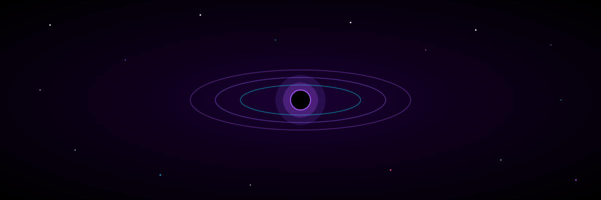

<div align="center">

<!-- HEADER -->


<!-- BLACKHOLE BANNER -->


<!-- TYPING EFFECT -->
<a href="https://git.io/typing-svg">
  
</a>

<!-- PROFILE VIEWS -->
<br/>


## 🕳️ `> about_me`

```javascript
const srajanFact = {
    name: "Srajan",
    title: "Full Stack Developer",
    location: "The Event Horizon 🌌",
    languages: ["JavaScript", "TypeScript", "Python"],
    tools: ["React", "Node.js", "Docker", "AWS", "MongoDB"],
    currentlyLearning: "Everything the void reveals 🕳️",
    funFact: "I compress bugs into singularities — they never escape."
};
```


## 🕳️ `> tech_stack`

<br/>


<br/>


## 🕳️ `> github_stats`

<br/>

<a href="https://github.com/Srajan-fact">
  
  
</a>

<br/>


## 🕳️ `> streak_stats`

<br/>

<a href="https://github.com/Srajan-fact">
  
</a>

<br/>


## 🕳️ `> activity_graph`

<br/>

<a href="https://github.com/Srajan-fact">
  
</a>

<br/>


## 🕳️ `> trophies`

<br/>

<a href="https://github.com/Srajan-fact">
  
</a>

<br/>


## 🕳️ `> snake_animation`

<br/>

<picture>
  <source media="(prefers-color-scheme: dark)" srcset="https://raw.githubusercontent.com/Srajan-fact/Srajan-fact/output/github-snake-dark.svg"/>
  
</picture>

<br/>


## 🕳️ `> connect_with_me`

<br/>

[](https://linkedin.com/in/MY_LINKEDIN_URL)
[](https://twitter.com/MY_TWITTER_URL)
[](https://MY_PORTFOLIO_URL)
[](mailto:MY_EMAIL)

<br/>


```
╔══════════════════════════════════════════════════════════════════╗
║                                                                  ║
║   "Somewhere, something incredible is waiting to be known."      ║
║                                          — Carl Sagan            ║
║                                                                  ║
╚══════════════════════════════════════════════════════════════════╝
```


</div>
